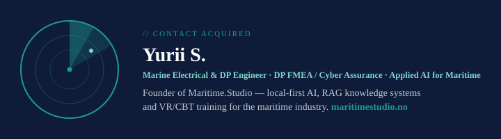
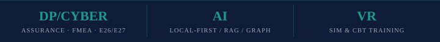

## Projects

**M.A.V.E.N.** — Multi-Agent Virtual Execution Network. A local-first control plane for a whole fleet of AI agents and models, in one console. *Private.*

[**X-Forge-Factory**](https://github.com/yuriiss/X-Forge-Factory) — operator console for Magnific across REST and MCP, with a job engine that reserves credits before it spends them, charges once, and gates large estimates behind a human.

[**EREBROS**](https://www.erebros.io) — Multi-Agent Control Plane. Cloud and local models, CLI agents and provider aggregators behind one interface; everything runs on your machine. *Private.*

## Focus

- Marine electrical & DP systems (DP2/DP3)
- DP FMEA / cyber resilience (IACS UR E26/E27)
- Applied AI for regulated maritime work — local-first, RAG, knowledge graphs
- Maritime e-learning — CBT, VR/AR

---

⚓ [maritimestudio.no](https://maritimestudio.no) · [LinkedIn](https://www.linkedin.com/company/maritime-studio) · [Facebook — Maritime.Studio](https://www.facebook.com/maritimstudio/) · [Facebook — SeaWanderer](https://www.facebook.com/seawanderernet) · [YouTube](https://www.youtube.com/@MaritimeStudio)
